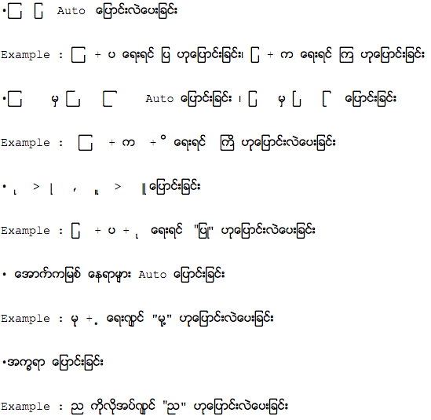
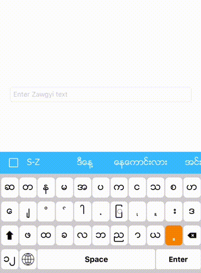

# SmartZawgyi


This is for converting zawgyi characters like this. It is written with Objective-C for iOS App.  



## Usuage in main app

```obj-c
- (BOOL)textField:(UITextField *)textField shouldChangeCharactersInRange:(NSRange)range replacementString:(NSString *)string {
    self.inputStr = string;
    return YES;
}

- (void)textFieldDidChange:(UITextField *)textField {
    if (!self.inputStr || self.inputStr.length == 0)
        return;
    
    textField.text = [self.convert convertExistingString:textField.text withInputCharacter:[self.inputStr characterAtIndex:0]];
}
``` 


## Usuage in Keyboard Extension

```obj-c
Convert *conv = [[Convert alloc] initWithAddTextBlock:^(NSString *str) {
        [self.textDocumentProxy insertText:str];
    } andDeleteText:^{
        [self.textDocumentProxy deleteBackward];
    }]; //Set up
       
[self.conv convertExistingText:self.textDocumentProxy.documentContextBeforeInput withInputCharacter:[character characterAtIndex:0]]; // Put all existing text and new character that user just type (1 char only)

``` 


## Output




